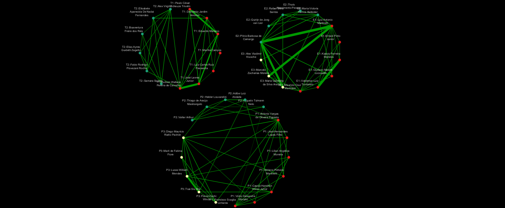

# Análise das linhas de pesquisa do CENA/USP

## Autor

- [Diego Mauricio Riaño Pachón](https://labbces.cena.usp.br/author/diego-mauricio-riano-pachon/)

## Justificativa

Esta metodologia foi desenvolvida para examinar a produção científica dos docentes do [CENA/USP](https://www.cena.usp.br/). 

## Resultados

### Rede de coautoria

O grafo resultante está em [coauthorship.graphml](data/coauthorship.graphml) e pode ser aberto no Cytoscape. A tabela abaixo resume o número de artigos atribuído a cada orientador no conjunto analisado, no periodo de 2021 a 2026, com base nos registros do OpenAlex. Divisão: P = DVPROD, E = DVECO e T = DVTEC.

| Professor | Divisão | Número de artigos |
| --- | --- | ---: |
| José Hernandes Lopes Filho | P | 5 |
| Lílian Angélica Moreira | P | 10 |
| Adibe Luiz Abdalla | P | 82 |
| Adriana Pinheiro Martinelli | P | 29 |
| Antonio Vargas de Oliveira Figueira | P | 27 |
| Augusto Tulmann Neto | P | 3 |
| Cassio Hamilton Abreu Junior | P | 35 |
| Diego Mauricio Riaño Pachón | P | 28 |
| Flavia Vischi Winck | P | 17 |
| Francisco Scaglia Linhares | P | 13 |
| Helder Louvandini | P | 61 |
| Lucas William Mendes | P | 155 |
| Thiago de Araújo Mastrangelo | P | 14 |
| Marli de Fatima Fiore | P | 32 |
| Valter Arthur | P | 42 |
| Alex Vladimir Krusche | E | 9 |
| Ernani Pinto Junior | E | 59 |
| Kassio Ferreira Mendes | E | 76 |
| Luiz Antonio Martinelli | E | 48 |
| Quirijn de Jong van Lier | E | 46 |
| Giuliano Maselli Locosselli | E | 33 |
| Marcelo Zacharias Moreira | E | 29 |
| Maria Gabriella da Silva Araújo | E | 15 |
| Maria Victoria Ramos Ballester | E | 8 |
| Marília Campos | T | 23 |
| Mauricio Cruz Mantoani | E | 22 |
| Paulo César Ocheuze Trivelin | T | 14 |
| Plínio Barbosa de Camargo | E | 95 |
| Rafael Silva Santos | E | 17 |
| Samara Soares | T | 17 |
| Thaís Nascimento Pessoa | E | 13 |
| Tsai Siu Mui | P | 73 |
| Victor Alexandre Vitorello | P | 2 |
| Valdemar Luiz Tornisielo | E | 35 |
| Fabio Rodrigo Piovezani Rocha | T | 45 |
| Deoclecio Jardim Amorim | T | 15 |
| Eduardo Mariano | T | 27 |
| Elias Ayres Guidetti Zagatto | T | 8 |
| Boaventura Freire dos Reis | T | 4 |
| Luiz Carlos Ruiz Pessenda | T | 37 |
| Elisabete Aparecida De Nadai Fernandes | T | 20 |
| Alex Virgilio | T | 14 |
| Hudson Wallace Pereira de Carvalho | T | 80 |
| José Lavres Junior | T | 91 |

No Cytoscape, os nós foram coloridos assim:

| Divisão | Cor usada | Código hexadecimal |
| --- | --- | ---: |
| DVPROD (P) | Laranja | #FEBD2A |
| DVECO (E) | Verde | #4CC26C | 
| DVTEC (T) | Roxo | #8B0AA5 | 


**Figura 1. Rede de coautoria dos docentes do CENA/USP (2021–2026).**
Os nós representam os docentes presentes em [candidates.json](data/candidates.json). Uma aresta indica ao menos um artigo compartilhado no OpenAlex; sua espessura corresponde ao número de artigos distintos em coautoria. As cores mostram as divisões científicas.

### Rede de similaridade semântica

##### Tabela de docentes e número de artigos com título, abstract e keywords incluidos na rede semântica

| Professor | Áreas | Artigos | Com texto | Com abstract | Com keywords |
| --- | --- | ---: | ---: | ---: | ---: |
| José Hernandes Lopes Filho | P | 5 | 5 | 4 | 5 |
| Lílian Angélica Moreira | P | 10 | 10 | 8 | 10 |
| Adibe Luiz Abdalla | P | 82 | 82 | 58 | 82 |
| Adriana Pinheiro Martinelli | P | 29 | 29 | 21 | 28 |
| Antonio Vargas de Oliveira Figueira | P | 27 | 27 | 22 | 27 |
| Augusto Tulmann Neto | P | 3 | 3 | 2 | 3 |
| Cassio Hamilton Abreu Junior | P | 35 | 35 | 26 | 35 |
| Diego Mauricio Riaño Pachón | P | 28 | 28 | 26 | 28 |
| Flavia Vischi Winck | P | 17 | 17 | 15 | 17 |
| Francisco Scaglia Linhares | P | 13 | 13 | 10 | 13 |
| Helder Louvandini | P | 61 | 61 | 35 | 61 |
| Lucas William Mendes | P | 155 | 155 | 77 | 155 |
| Thiago de Araújo Mastrangelo | P | 14 | 14 | 12 | 14 |
| Marli de Fatima Fiore | P | 32 | 32 | 24 | 30 |
| Valter Arthur | P | 42 | 42 | 40 | 42 |
| Alex Vladimir Krusche | E | 9 | 9 | 6 | 9 |
| Ernani Pinto Junior | E | 59 | 59 | 41 | 58 |
| Kassio Ferreira Mendes | E | 76 | 76 | 63 | 76 |
| Luiz Antonio Martinelli | E | 48 | 48 | 29 | 48 |
| Quirijn de Jong van Lier | E | 46 | 46 | 32 | 46 |
| Giuliano Maselli Locosselli | E | 33 | 33 | 20 | 33 |
| Marcelo Zacharias Moreira | E | 29 | 29 | 16 | 29 |
| Maria Gabriella da Silva Araújo | E | 15 | 15 | 10 | 15 |
| Maria Victoria Ramos Ballester | E | 8 | 8 | 7 | 8 |
| Marília Campos | T | 23 | 23 | 9 | 23 |
| Mauricio Cruz Mantoani | E | 22 | 22 | 17 | 22 |
| Paulo César Ocheuze Trivelin | T | 14 | 14 | 8 | 14 |
| Plínio Barbosa de Camargo | E | 95 | 95 | 53 | 95 |
| Rafael Silva Santos | E | 17 | 17 | 6 | 17 |
| Samara Soares | T | 17 | 17 | 5 | 17 |
| Thaís Nascimento Pessoa | E | 13 | 13 | 6 | 13 |
| Tsai Siu Mui | P | 73 | 73 | 50 | 73 |
| Victor Alexandre Vitorello | P | 2 | 2 | 2 | 2 |
| Valdemar Luiz Tornisielo | E | 35 | 35 | 25 | 35 |
| Fabio Rodrigo Piovezani Rocha | T | 45 | 45 | 22 | 45 |
| Deoclecio Jardim Amorim | T | 15 | 15 | 12 | 15 |
| Eduardo Mariano | T | 27 | 27 | 16 | 27 |
| Elias Ayres Guidetti Zagatto | T | 8 | 8 | 6 | 8 |
| Boaventura Freire dos Reis | T | 4 | 4 | 3 | 4 |
| Luiz Carlos Ruiz Pessenda | T | 37 | 37 | 19 | 37 |
| Elisabete Aparecida De Nadai Fernandes | T | 20 | 20 | 10 | 20 |
| Alex Virgilio | T | 14 | 14 | 10 | 14 |
| Hudson Wallace Pereira de Carvalho | T | 80 | 80 | 50 | 80 |
| José Lavres Junior | T | 91 | 91 | 58 | 91 |

##### Ligações mais fortes de acordo com a similaridade semântica entre orientadores (2021–2026)

| Professor 1 | Professor 2 | Similaridade | Artigos compartilhados |
| --- | --- | ---: | ---: |
| Luiz Antonio Martinelli | Plínio Barbosa de Camargo | 0.972827 | 13 |
| Kassio Ferreira Mendes | Valdemar Luiz Tornisielo | 0.969086 | 14 |
| Luiz Antonio Martinelli | Marcelo Zacharias Moreira | 0.968995 | 4 |
| Hudson Wallace Pereira de Carvalho | José Lavres Junior | 0.966935 | 14 |
| Maria Gabriella da Silva Araújo | Plínio Barbosa de Camargo | 0.966906 | 3 |
| Cassio Hamilton Abreu Junior | José Lavres Junior | 0.963781 | 5 |
| Lucas William Mendes | Tsai Siu Mui | 0.962672 | 22 |
| Paulo César Ocheuze Trivelin | Eduardo Mariano | 0.960274 | 3 |
| Cassio Hamilton Abreu Junior | Hudson Wallace Pereira de Carvalho | 0.958170 | 1 |
| Eduardo Mariano | José Lavres Junior | 0.955692 | 5 |
| Cassio Hamilton Abreu Junior | Eduardo Mariano | 0.954282 | 1 |
| Marcelo Zacharias Moreira | Plínio Barbosa de Camargo | 0.952268 | 4 |
| Plínio Barbosa de Camargo | Rafael Silva Santos | 0.950232 | 0 |
| Lílian Angélica Moreira | Paulo César Ocheuze Trivelin | 0.949202 | 0 |
| Paulo César Ocheuze Trivelin | José Lavres Junior | 0.947837 | 0 |
| Marcelo Zacharias Moreira | Maria Gabriella da Silva Araújo | 0.946419 | 2 |
| Plínio Barbosa de Camargo | Luiz Carlos Ruiz Pessenda | 0.946386 | 0 |
| Lílian Angélica Moreira | José Lavres Junior | 0.945746 | 3 |
| Plínio Barbosa de Camargo | Deoclecio Jardim Amorim | 0.945170 | 0 |
| Giuliano Maselli Locosselli | Plínio Barbosa de Camargo | 0.944615 | 0 |


**Figura 2. Rede semântica global.**
Não é clara a existencia de comunidades temáticas bem definidas, mas há pares de docentes com alta similaridade semântica. As cores dos nós correspondem ás divisões científicas: P = laranja, E = verde e T = roxo. A espessura das arestas indica a similaridade semântica entre os docentes, calculada com base em títulos, resumos e palavras-chave dos artigos.

### Rede de similaridade semântica por divisão científica

As saídas em `data/` incluem [area_semantic.graphml](data/area_semantic.graphml) (que pode ser visualizado em Cytoscape) e os arquivos [area_semantic_P.graphml](data/area_semantic_P.graphml), [area_semantic_E.graphml](data/area_semantic_E.graphml) e [area_semantic_T.graphml](data/area_semantic_T.graphml); [area_semantic_nodes.csv](data/area_semantic_nodes.csv) e [area_semantic_edges.csv](data/area_semantic_edges.csv) descrevem seus nós e arestas. [area_semantic_matrix_P.csv](data/area_semantic_matrix_P.csv), [area_semantic_matrix_E.csv](data/area_semantic_matrix_E.csv) e [area_semantic_matrix_T.csv](data/area_semantic_matrix_T.csv) preservam os pares comparáveis que não aparecem nas redes. [area_semantic_coverage.csv](data/area_semantic_coverage.csv) mostra quantos artigos de cada docentes foram aproveitados em cada divisão. Os vetores dos artigos ficam em cache em [area_semantic_embeddings.npz](data/area_semantic_embeddings.npz), de modo que uma nova execução após a curadoria no arquivo ([work_area_curated.csv](data/work_area_curated.csv)) pode reutilizá-los.


**Figura 3. Redes semânticas por divisão científica.**
A imagem apresenta três conjuntos separados: DVTEC (T), à esquerda; DVECO (E), na região superior direita; e , DVPROD (P) abaixo. Cada nó corresponde à atuação de um docente naquela divisão, identificada pelo prefixo P::, E:: ou T::. As linhas verdes ligam pares de orientadores dentro da mesma área. A separação entre P, E e T decorre da construção da rede, que não inclui arestas entre áreas. As posições dos nós também dependem do algoritmo de disposição e não devem ser interpretadas como uma escala numérica de similaridade. As cores dos nós correspondem ás comunidades detectadas pelo algoritmo de Louvain. A espessura das arestas indica a similaridade semântica entre os docentes, calculada com base em títulos, resumos e palavras-chave dos artigos. É claro que dentro de cada divisão existen comunidades com maior afinidade temática.

### Proposta de especialidades por divisão científica

Est proposta usa a análise de redes semânticas como subsidio para agrupar docentes com afinidade temática, e identificar áreas grandes de atuacão dos docentes do CENA/USP. Precisa de maior discussão e validação com os docentes, mas pode ajudar a identificar especialidades. A proposta está centrada nas comunidades detectadas pelo algoritmo de Louvain, mas em algúns caso sugeri especialidades adicionais (*) com base no conhecimento das linhas de pesquisa do CENA/USP. A proposta de especialidades por divisão científica é apresentada abaixo.

#### Divisão de Produtividade Agroindustrial e Alimentos - P 

| Grupo | Especialidades |
| --- | --- |
| P1 | Nutricão vegetal e fertilidade do solo |
| P2 | Técnicas Nucleares Aplicadas a Biologia de Organismos |
| P3 | Biologia integrativa e ômicas |
| *P4 | Biotecnologia e Melhoramento de Plantas |

#### Divisão de Funcionamento de Ecossistemas Tropicais - E

| Grupo | Especialidades |
| --- | --- | 
| E1 | Contaminantes na Agricultura e no Ambiente |
| E2 |  |
| E3 | Ecologia de ecossistemas e mudanças climáticas |

#### Divisão de Desenvolvimento de Métodos e Técnicas Analíticas Nucleares - T

| Grupo | Especialidades |
| --- | --- |
| T1 | Técnicas Nucleares na Agricultura e no Ambiente|
| T2 | Técnicas Analíticas na Agricultura e no Ambiente |

## Métodos

## Dependências

Para executar os scripts abaixo precisa das seguintes bibliotecas de python3 instaladas:

```bash
git clone git@github.com:labbces/CENA_Research_Lines.git
cd CENA_Research_Lines
python -m venv .venv
source .venv/bin/activate
python -m pip install openpyxl numpy sentence-transformers scipy scikit-learn networkx
```

### Seleção dos orientadores

A lista de professores foi obtida em outubro de 2026 a partir do website do CENA/USP, dados foram registrados em [supervisors.json](data/supervisors.json). Neste documento, **P** corresponde a Divisão de Produtividade Agroindustrial e Alimentos; **T**, a Divisão de Desenvolvimento de Métodos e Técnicas Analíticas Nucleares; e **E**, a Divisão de  Funcionamento de Ecossistemas Tropicais. Um professor só pode estar vinculado a uma divisão.

Os perfis dos orientadores foram procurados no [OpenAlex](https://openalex.org/) por meio de sua [API](https://api.openalex.org), usando [collect.py](scripts/collect.py):

```bash
python3 ./scripts/collect.py ../CENA_Research_Lines/
```

Os resultados dessa busca foram conferidos manualmente para eliminar homônimos e manter os perfis validados com ORCID, um perfil por docente. Os identificadores selecionados estão em [candidates.json](data/candidates.json). Essa revisão é importante porque um perfil atribuído ao docente errado contaminaria todas as etapas seguintes. Todos os docentes estão presentes em [candidates.json](data/candidates.json).

### Recuperação das publicações

A consulta ao OpenAlex ocorreu em **3º de outubro de 2026**. O [works.py](scripts/works.py) disponível neste projeto solicita trabalhos publicados de **1º de janeiro de 2021 a 31 de dezembro de 2026**. O script consulta os perfis selecionados em `candidates.json` e guarda as respostas da API em arquivos JSON separados por identificador de autor.

Os arquivos de trabalhos são gravados em sua subpasta `data/raw/`.

```bash
python3 ./scripts/works.py ../CENA_Research_Lines/
```

O script [works_to_excel.py](scripts/works_to_excel.py), gera uma [planilha de publicações](data/candidate_publications.xlsx) com os detalhes das publicações dos orientadores. Foram identificados **2.049 registros** de publicações de diferentes tipos, incluindo artigos, livros, capítulos e preprints. A planilha contém título, DOI, lista de autores, orientador associado, ano, tipo de publicação e ID do trabalho no OpenAlex. Um mesmo trabalho pode aparecer em mais de uma linha se estiver associado a mais de um orientador; portanto, o número de registros não representa necessariamente 2.049 publicações distintas. Os resumos e as palavras-chave permanecem nos arquivos JSON usados na análise semântica, mas não são exportados por esta versão de `works_to_excel.py`.

### Rede de coautoria

O script [coauthorship.py](scripts/coauthorship.py) constrói uma rede somente com os docentes de `candidates.json`, considerando registros do OpenAlex com `type = article`. Cada nó representa um docente. Dois nós são ligados quando os respectivos docentes aparecem associados ao **mesmo ID de trabalho do OpenAlex**; o peso da aresta é o número de artigos distintos compartilhados. Um artigo é contado apenas uma vez por orientador, mesmo quando há identificadores de autor duplicados ou registros repetidos nos arquivos de entrada.

```bash
python3 ./scripts/coauthorship.py ../CENA_Research_Lines/
```

### Similaridade semântica entre orientadores

O script [semantic_similarity.py](scripts/semantic_similarity.py) utiliza títulos, resumos (*abstracts*) e palavras-chave (*keywords*) dos artigos para estimar a proximidade temática entre docentes. Ele usa um modelo da biblioteca [Sentence Transformers](https://www.sbert.net/) para transformar textos em **embeddings**: vetores numéricos cujas posições procuram representar relações de significado aprendidas durante o treinamento. Neste estudo, a semelhança entre vetores é usada como aproximação da semelhança entre os temas dos textos; não é uma classificação definitiva das linhas de pesquisa.

#### Como o transformer produz um embedding

1. **Divisão em tokens.** O texto é separado em unidades menores, chamadas *tokens*. Elas podem corresponder a palavras inteiras ou a partes de palavras. Os tokens são convertidos em identificadores numéricos de entrada do modelo.
2. **Representação contextual.** O transformer processa os tokens em conjunto. Pelo mecanismo de *[atenção](https://doi.org/10.48550/arXiv.1706.03762)*, a representação de cada token é ajustada com base nos demais tokens do mesmo trecho. Por isso, uma palavra pode contribuir de formas diferentes conforme o contexto em que aparece. Essa representação é aprendida pelo modelo durante o treinamento; o script não atribui manualmente um valor a cada palavra.
3. **Agregação dos tokens.** Para obter um único vetor por trecho de texto, o modelo Sentence Transformers combina as representações contextualizadas dos tokens por uma operação chamada *pooling*. Nos dois modelos mencionados abaixo, a operação configurada é a média dos tokens válidos, desconsiderando o preenchimento usado nos lotes. O resultado é um vetor denso: **1024** com `BAAI/bge-large-en-v1.5` ou  **768 dimensões** com `all-mpnet-base-v2` ou **384 dimensões** com `paraphrase-multilingual-MiniLM-L12-v2`. Cada dimensão participa da representação aprendida; ela não deve ser interpretada isoladamente como um tema específico.
4. **Normalização.** O script normaliza esses vetores para comprimento unitário antes de combiná-los. Dessa forma, a comparação posterior se concentra na direção dos vetores, e não em sua magnitude.

Essas etapas descrevem a codificação **de um trecho de texto**. O script ainda precisa combinar trechos, campos e artigos:

1. **Trechos de texto:** antes de enviar um campo ao modelo, o script o divide em blocos de até 112 tokens de texto por padrão, respeitando o limite do modelo e reservando espaço para seus tokens especiais. A opção `--max-tokens N` muda o limite total de cada trecho, **incluindo** os tokens especiais; por exemplo, com `--max-tokens 512`, um modelo que usa dois tokens especiais recebe no máximo 510 tokens do texto. Um valor acima do limite do modelo produz um erro explícito. Isso evita descartar o fim de resumos longos. Se houver vários blocos, calcula a média de seus vetores e normaliza o resultado. A média preserva informação dos blocos, mas não representa as relações de ordem entre blocos distantes.
2. **Campos de um artigo:** combina separadamente os vetores do título, do resumo e das palavras-chave. Com os valores padrão, seus pesos relativos são, respectivamente, **25%, 60% e 15%**. Se faltar um campo, os pesos dos campos presentes são redistribuídos proporcionalmente. O vetor final do artigo é normalizado. Esses pesos são escolhas metodológicas do script, não parâmetros aprendidos pelo transformer, e podem ser alterados por opções de linha de comando.
3. **Artigos de um docente:** combina os vetores dos artigos do docente, dando o mesmo peso a cada artigo, e normaliza o perfil resultante. O script trabalha apenas com registros `type = article` e usa o intervalo de datas indicado na execução.
4. **Comparação entre dois docentes:** por padrão, retira dos **dois perfis daquele par** os artigos que ambos assinaram. Isso evita que um mesmo trabalho compartilhado aumente diretamente a similaridade do par. Os perfis usados nessa comparação, portanto, podem variar conforme o par; se um orientador ficar sem artigos após a exclusão, não há valor de similaridade para esse par. A opção `--include-shared` mantém os artigos compartilhados.
5. **Similaridade e rede:** calcula o **cosseno** entre os dois perfis normalizados, equivalente ao produto escalar de seus vetores. O valor matemático está entre −1 e 1; valores maiores indicam direções mais próximas, mas **não são porcentagens de temas em comum nem probabilidades**. O parâmetro `--top-k` escolhe os *k* vizinhos comparáveis mais próximos de cada orientador. A rede contém a **união** dessas escolhas: uma ligação entra se for escolhida por pelo menos um dos dois nós, de modo que um nó pode terminar com mais de *k* ligações. A matriz CSV guarda também as comparações que não viraram arestas.

#### Resultados da análise da rede semântica

Nesta análise foi escolhido o modelo [BAAI/bge-large-en-v1.5](https://huggingface.co/BAAI/bge-large-en-v1.5), outras alternativas mais baratas computacionalmente são [all-mpnet-base-v2](https://huggingface.co/sentence-transformers/all-mpnet-base-v2) para textos majoritariamente em inglês, e [paraphrase-multilingual-MiniLM-L12-v2](https://huggingface.co/sentence-transformers/paraphrase-multilingual-MiniLM-L12-v2), uma alternativa quando os textos incluem vários idiomas (este último é o **padrão do script**). São modelos de uso geral para embeddings de frases e parágrafos; nesta análise não houve ajuste adicional do modelo para o vocabulário específico do CENA/USP. A escolha do modelo afeta os vetores e, portanto, pode alterar as similaridades e as arestas. A base para a seleção do modelo foi um [benchmark recente](http://dx.doi.org/10.30970/eli.30.4) que avaliou varios modelos de embeddings em tarefas de similaridade semântica, classificação e recuperação de informação. O modelo BGE Large obteve o melhor na captura de relações semânticas, seguido por all-mpnet-base-v2 e paraphrase-multilingual-MiniLM-L12-v2.

```bash
python3 scripts/semantic_similarity.py ../CENA_Research_Lines/ \
  --model BAAI/bge-large-en-v1.5 \
  --max-tokens 512 \
  --device cpu \
  --top-k 4
```

Com essa execução, o script lê os arquivos em `PROJECT_ROOT/data/`, usa por padrão artigos de 2021 a 2026 **que estejam presentes nos arquivos JSON** e grava a rede em [semantic_similarity.graphml](data/semantic_similarity.graphml) (que pode ser visualizada em Cytoscape), além da [tabela de nós](data/semantic_similarity_nodes.csv), da [lista de arestas](data/semantic_similarity_edges.csv) e da [matriz completa de similaridade](data/semantic_similarity_matrix.csv). Os resultados descrevem proximidade no espaço vetorial do modelo.

A rede gerada por `semantic_similarity.py` reúne todos os docentes em uma única comparação. Ela ajuda a reconhecer afinidades temáticas que atravessam as divisões científicas e a localizar pares cuja produção merece leitura mais atenta. Para interpretar seus resultados, convém distinguir os arquivos produzidos:

| Arquivo em `data/` | O que permite examinar |
| --- | --- |
| `semantic_similarity_nodes.csv` | Docentes, divisões científicas e número de artigos com texto utilizável. |
| `semantic_similarity_edges.csv` | Pares exibidos na rede, cosseno em `weight` e número de artigos que o par assinou em conjunto. |
| `semantic_similarity_matrix.csv` | Similaridade de todos os pares comparáveis, inclusive daqueles que ficaram fora da rede após a seleção dos vizinhos. |
| `semantic_similarity.graphml` | Rede para exploração visual no Cytoscape. |

Uma aresta forte sugere que os artigos **não compartilhados** daquele par tratam de assuntos próximos no espaço vetorial do modelo. A ausência de aresta **não** significa necessariamente baixa similaridade: o par pode simplesmente não ter sido escolhido entre os quatro vizinhos mais próximos de nenhum dos orientadores. Para conferir isso, consulte a matriz completa. Uma célula vazia indica que não foi possível calcular a similaridade do par, por exemplo, quando não restam artigos com texto após a exclusão dos trabalhos em coautoria. Os escores devem ser confrontados com títulos e resumos; sozinhos, não identificam linhas de pesquisa nem explicam a causa da proximidade.

### Da rede global às análises por área de concentração

O script [area_semantic.py](scripts/area_semantic.py) responde a uma pergunta mais específica: **quais docentes se aproximam quando consideramos apenas os artigos pertinentes a uma determinada divisão científica?** Ele importa funções de `semantic_similarity.py` para ler os dados, gerar embeddings e calcular comparações, mas **não lê** `semantic_similarity.graphml`, a lista de arestas ou a matriz CSV da rede global. Pode, portanto, ser executado diretamente sobre `candidates.json`, `supervisors.json` e os JSON de artigos em `data/raw/`. Para comparar as duas análises, use o mesmo modelo, os mesmos pesos dos campos e o mesmo intervalo de datas.

1. **Comunidades e temas propostos.** Em cada rede (P, E, e T), o algoritmo de [Louvain](https://doi.org/10.1088/1742-5468/2008/10/P10008) identifica comunidades sem impor previamente sua quantidade. Separadamente, um agrupamento hierárquico propõe **três grupos por área** com `--groups 3`, quando há docentes suficientes. Esse agrupamento combina, por padrão, 75% de similaridade semântica e 25% de proximidade lexical calculada por [TF-IDF](https://en.wikipedia.org/wiki/Tf%E2%80%93idf) sobre os textos da própria área; se não há escore semântico para um par, usa sua proximidade lexical. Os termos distintivos e títulos representativos ajudam a descrever cada grupo, mas são rótulos exploratórios, não nomes apropriados para linhas de pesquisa.

```bash
python3 scripts/area_semantic.py ../CENA_Research_Lines/ \
  --model BAAI/bge-large-en-v1.5 \
  --max-tokens 512 \
  --device cpu \
  --top-k 4  \
  --groups 3
```