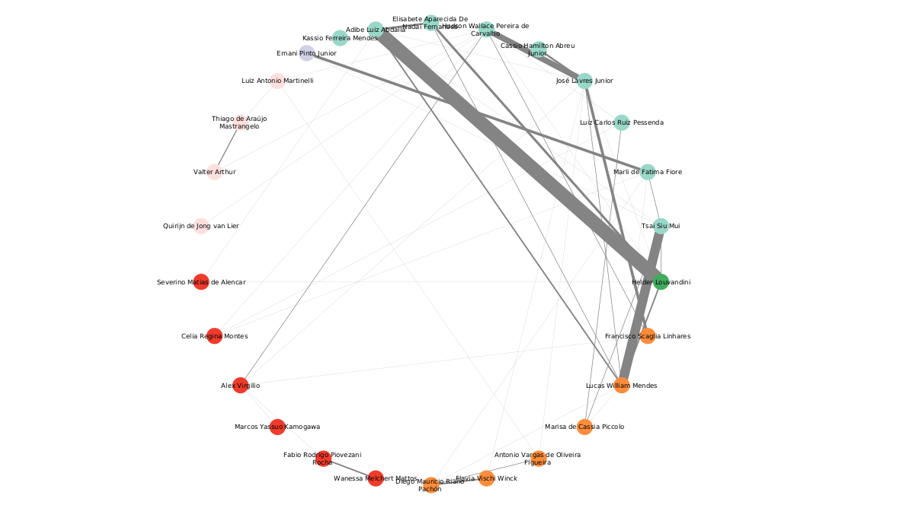
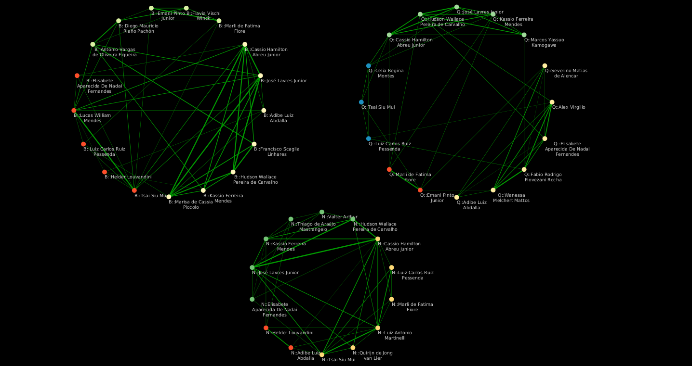

# Proposta de reorganizacao das linhas de pesquisa do PPG-Ciências CENA/USP

## Autor

- [Diego Mauricio Riaño Pachón](https://labbces.cena.usp.br/author/diego-mauricio-riano-pachon/)

## Justificativa

Está é uma metodologia proposta para agrupar as linhas de pesquisa dos orientadores do PPG-Ciencias CENA/USP. Atualmente existem 16 linhas de pesquisa. O intuito é reduzir esse número de acordo a temas mais gerais, e que agrupem varios orientadores. Atualmente existem linhas de pesquisa com um único orientador o que não é desejavel.

## Métodos

## Dependências

Para executar os scripts abaixo precisa das seguintes biobliotecas instaladas:

```bash
python -m pip install openpyxl numpy sentence-transformers scipy scikit-learn networkx
```

### Orientadores
Foi coletada a lista de orientadores atualmente credenciados no programa (08/2026), a informacão foi armazenada num arquivo [json](data/supervisors.json), indicando as áreas de concentracão em que atua cada orientador.

Foram identificados os perfis dos orientadores no [OpenAlex](https://openalex.org/) usando sua [API](https://api.openalex.org), usando o script [collect.py](scripts/collect.py)

```bash
python3 ./scripts/collect.py ../PPG_Ciencias_Research_Lines/
```

Essa primeira busca tem que ser curada manualmente para remover homonimos, e manter só orientadores validados com ORCID. O resultado está no arquivo [candidates.json](data/candidates.json).

### Recuperando as publicacoes dos orientadores

Foram analizadas as publicacoes desde janeiro de 2021. Nos scripts usados as datas são controladas pelas variaveis START_DATE e END_DATE. A coleta das publicacoes foi realizada em 01/10/2026 a travez de consulta automatizada no banco de dados [OpenAlex](https://openalex.org/) usando sua [API](https://api.openalex.org), usando o script [works.py](scripts/works.py).


```bash
python3 ./scripts/works.py ../PPG_Ciencias_Research_Lines/
```
The script [works_to_excel.py](scripts/works_to_excel.py), gera uma [tabela de excel](data/candidate_publications.xlsx) com os detalhes das publicacoes dos orientadores. 

### Navegando a rede de co-autoria

Usando as publicacoes dos orientadores gerei uma rede de co-autoria para explorar a formacao de comunidades a partir dessas intereacoes, usando o script [coauthorship.py](scripts/coauthorship.py), que gera um grafo em formato [graphml](data/coauthorship.graphml), e tam

```bash
python3 ./scripts/coauthorship.py ../PPG_Ciencias_Research_Lines/
```

Os nós foram coloridos baseados nas áreas de concentracao:

| Área | Cor | Hex code |
| --- | --- | ---: |
| Biologia (B) | Laranja | #FD8D3C |
| Nuclear (N) | Rosa | #FDE0DD | 
| Química (Q) | Vermelho | #EF3B2C | 
| B + N | Verde | #41AB5D | 
| B + Q | Lilas | #D0D1E6 | 
| B + N + Q | Verde claro | #99D8C9 | 


**Figura. Rede de coautoria dos orientadores do PPG-Ciências (2021–2026).**
Cada nó representa um orientador incluído em [candidates.json](data/candidates.json). Uma aresta liga dois orientadores quando ambos são autores de pelo menos um artigo registrado no OpenAlex (identificado pelo DOI); sua espessura representa o número de artigos distintos em coautoria. As cores indicam as áreas de concentração informadas em [supervisors.json](data/supervisors.json): B = Biologia na Agricultura e no Ambiente; N = Energia Nuclear na Agricultura e no Ambiente; Q = Química na Agricultura e no Ambiente. Orientadores vinculados a mais de uma área aparecem nas categorias combinadas B+N, B+Q ou B+N+Q.

Aqui tem um resumo do número de publicacoes por orientador no periodo pesquisado:

| Orientador | Áreas | Número de artigos |
| --- | --- | ---: |
| Adibe Luiz Abdalla | B+N+Q | 83 |
| Antonio Vargas de Oliveira Figueira | B | 27 |
| Cassio Hamilton Abreu Junior | B+N+Q | 35 |
| Diego Mauricio Riaño Pachón | B | 27 |
| Elisabete Aparecida De Nadai Fernandes | B+N+Q | 20 |
| Ernani Pinto Junior | B+Q | 58 |
| Flavia Vischi Winck | B | 17 |
| Francisco Scaglia Linhares | B | 13 |
| Helder Louvandini | B+N | 62 |
| Hudson Wallace Pereira de Carvalho | B+N+Q | 80 |
| José Lavres Junior | B+N+Q | 90 |
| Kassio Ferreira Mendes | B+N+Q | 75 |
| Lucas William Mendes | B | 155 |
| Luiz Carlos Ruiz Pessenda | B+N+Q | 37 |
| Marisa de Cassia Piccolo | B | 36 |
| Marli de Fatima Fiore | B+N+Q | 32 |
| Tsai Siu Mui | B+N+Q | 73 |
| Luiz Antonio Martinelli | N | 48 |
| Quirijn de Jong van Lier | N | 46 |
| Thiago de Araújo Mastrangelo | N | 14 |
| Valter Arthur | N | 42 |
| Alex Virgilio | Q | 14 |
| Celia Regina Montes | Q | 20 |
| Fabio Rodrigo Piovezani Rocha | Q | 45 |
| Marcos Yassuo Kamogawa | Q | 5 |
| Severino Matias de Alencar | Q | 104 |
| Wanessa Melchert Mattos | Q | 35 |

### Similaridade semantica entre orientadores

No script [semantic_similarity.py](scripts/semantic_similarity.py), combino o título, abstract e keywords de cada artigo para calcular umn perfil temático por orientador, para depois mensurar a similaridade entre esses perfis e criar uma rede semantica. O peso da aresta é a similaridade de [cosseno](https://en.wikipedia.org/wiki/Cosine_similarity). Por padrão, artigos escritos em conjunto são retirados da comparação daquele par, para que a coautoria não aumente diretamente a similaridade. O script usa modelos transformer automaticamente descarregaods do [Hugging Face](https://huggingface.co/). Como a maioria dos artigos estão em ingles, vou usar o modelo [sentence-transformers/all-mpnet-base-v2](https://huggingface.co/sentence-transformers/all-mpnet-base-v2), alternativamente e para textos en diversos linguagfem poderia ser usado o modelo [sentence-transformers/paraphrase-multilingual-MiniLM-L12-v2](https://huggingface.co/sentence-transformers/paraphrase-multilingual-MiniLM-L12-v2). Ambos esses modelos foram treinados para textos de temas gerais, não especificamente para textos cientificos.

De forma sucinta. O script mede proximidade temática entre orientadores, usando os textos dos artigos. Ele não compara diretamente os nomes dos autores nem conta quantas palavras iguais aparecem.
- Representa cada artigo como um vetor. O modelo transforma título, abstract e keywords em vetores numéricos. Se o abstract for longo, o script o divide em partes e combina os vetores dessas partes.
- Combina os três campos. Quando todos estão disponíveis, os pesos são 25% para o título, 60% para o abstract e 15% para as keywords. Se faltar algum campo, o script redistribui proporcionalmente o peso entre os campos presentes. O vetor resultante é normalizado. Os pessos dos campos podem ser alterados na linha de comendo na hora de rodar o script.
- Cria um perfil por orientador. O script combina os vetores dos artigos daquele orientador e normaliza o resultado. Assim, cada artigo contribui para a direção do perfil temático.
- Compara dois perfis pelo cosseno. Vetores que apontam em direções parecidas recebem similaridade maior. O resultado pode variar de −1 a 1. O número é uma medida relativa de proximidade no modelo, não uma porcentagem de assuntos compartilhados.
- Antes de comparar um par de orientadores, o script retira os artigos que ambos assinaram dos dois perfis usados naquele par. Por exemplo, se A e B publicaram juntos um artigo sobre microbioma, esse artigo não cria, por si só, uma ligação temática entre eles. Essa exclusão pode ser desligada com --include-shared.
- Não todas as arestas são mantidas na rede final. O parametro *--top-k* seleciona, para cada orientador, os *k* colegas com maior similaridade. Estou usando k=4 nessas analises.

```bash
python3 scripts/semantic_similarity.py ../PPG_Ciencias_Research_Lines/ --device cpu --model sentence-transformers/all-mpnet-base-v2  --top-k 4
```

